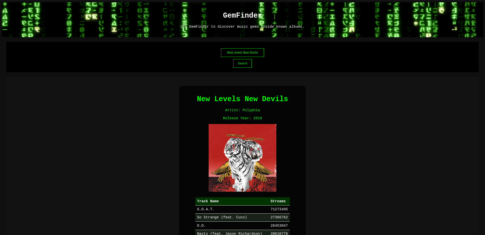

# GemFinder
I got mad at Spotify for not allowing me to rank tracks by stream counts inside album views.

## Installation
- `pip install -r requirements.txt`;
- rename `.env.example` to `.env`;
- grab `AUTH_TOKEN` from a valid Spotify session;
- grab `CLIENT_TOKEN` from a valid Spotify Desktop installation (this one might be tricky, as you need to intercept their SSL traffic. Install a root CA like Charles or Burp Suite onto `/usr/local/share/ca-certificates`, run `update-ca-certificates`, configure your local proxy and sniff away);
- `AUTH_TOKEN` has a small lifespan so you might need to renew it from time to time or else app will explode into pieces when it tries to smoke a JSON and finds out it was a fat 401 in its face;
- brace yourself!

## Usage
- `flask run`;
- head onto http://127.0.0.1:5000/;
- type a cool album you'd enjoy seeing stream stats;
- lots of room for activities. Did you expect the ranking to be what it actually is?
- you can grab 2 or 3 "lesser-than-the-albums-big-hit" tracks from a couple albums of an artist and compile into a kewl playlist!
- I even did [one for John Frusciante](https://open.spotify.com/playlist/4BmdtlKYukGwO15sQEVSBD?si=90df900212e74539 "#3 cause i already had 2 playlist of him, heh") and [one for Múm](https://open.spotify.com/playlist/2cyJ7hWSoXPmYylvrMu58C?si=b9deac1d702045d5 "proceed with caution, múm hits too hard on the feels sometimes!") as cool proof-of-concepts;
- if you're into foss, you can also help me understand how to transform this into a game where you'd try to guess the order, and then finding out how many did you get right;
- also, how do I host this thing? I'd love to get an easier demo to the world someday. 

## Preview

